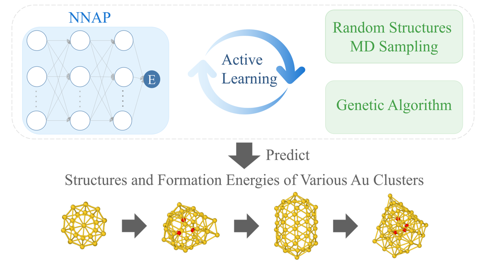

# AL-Sampling: Active Learning Sampling Strategies for NNAPs
<p align="center">
  
</p>
This repository provides the core **Active Learning Sampling Methods (Query Strategies)** implemented for the global structure search of neutral Gold clusters. 

To systematically explore the complex Potential Energy Surface (PES) and construct a highly robust Neural Network Atomic Potential (NNAP) with minimal DFT computational cost, we employ a dual-stage sampling framework:

1. **Diversity-based Sampling (`CUR.py`)**: Promotes *exploration* by selecting geometrically novel configurations from a massive pool generated by Genetic Algorithms (GA).
2. **Uncertainty-based Sampling (`uncertainty.py`)**: Promotes *exploitation* by identifying and sampling critical structures where the current NNAP model exhibits high predictive errors.

---

## Dependencies

Ensure you have the following basic Python packages installed before running the scripts:

```bash
pip install numpy scipy tqdm ase
```

> ** Important Note on `jsex` (NNAP Model):** 
> Loading and evaluating the NNAP model in the uncertainty sampling module (`uncertainty.py`) requires the `jse` / `jsex` package. As this package requires specific compilation and environment setup, please refer to its official repository for detailed installation instructions: 
> ** [https://github.com/liqa1024/jse](https://github.com/liqa1024/jse)**

---

## Sampling Methods Overview

### 1. Diversity-based Sampling via CUR Decomposition (`CUR.py`)
This module calculates global, rotationally invariant structural descriptors based on the **Spherical-Chebyshev basis**. It then performs a deterministic **CUR Matrix Decomposition** to extract a maximally diverse subset from the candidate pool.

**Key Feature:** Incorporates a *Prior-Knowledge Orthogonalization* mechanism. It actively purges structural features that are already well-represented in the existing training database, ensuring pure novelty in the selected samples.

**Example Usage:**
```python
from CUR import cur_select_structures

# Sample 200 diverse structures from the GA candidate pool, 
# while actively avoiding geometries already in 'training_base.db'.
cur_select_structures(
    db_in_path="raw_GA_candidates.db",     
    db_out_path="sampled_for_DFT.db",     
    n_select=200,                          
    db_based_path="training_base.db"       
)
```

### 2. Uncertainty-based Sampling (`uncertainty.py`)
After evaluating the selected subset with first-principles (DFT) calculations, this module acts as a strict filter by computing the per-atom energy prediction error $U(S)$ of the current NNAP model. It queries the structures with the highest epistemic uncertainty for inclusion in the next training iteration.

**Example Usage:**
```python
from uncertainty import select_by_energy_uncertainty

# Query the top 50 structures with the highest energy prediction errors.
select_by_energy_uncertainty(
    db_in_path="validation_set.db",        
    db_out_path="high_error_sampled.db",   
    top_k=50,                              
    jnn_path="path/to/your/nnap.jnn"       
)
```

---

## 🔄 Active Learning Generation Cycle

In our global search workflow, these sampling strategies are coupled iteratively:

1. **Generation (GA)**: Generate thousands of candidate clusters.
2. **Exploration (CUR Diversity)**: Run `CUR.py` to down-sample the vast dataset into a diverse, affordable query batch (e.g., 200 structures).
3. **Oracle Labeling (DFT)**: Calculate true energies for the sampled batch using VASP.
4. **Exploitation (Uncertainty Filter)**: Run `uncertainty.py` to compare DFT results with NNAP predictions. Only configurations exceeding the error threshold (e.g., top 50) are physically added to the training set.
5. **Model Retraining**: Train the NNAP and advance to the next generation.

---
